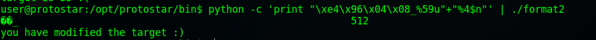

# Exploit-Exercises Protostar Writeup - Format

## Before Start
If you don't have much experience in Format String Attack, I recommend you to go through the following reading materials.      
[Format String Attack](https://www.owasp.org/index.php/Format_string_attack)    
[Stanford CS115 Paper About Format String Vulnerabilities](https://crypto.stanford.edu/cs155/papers/formatstring-1.2.pdf)        
[An Abstract Version](http://www.cis.syr.edu/~wedu/Teaching/cis643/LectureNotes_New/Format_String.pdf)

## [Format0](https://exploit-exercises.com/protostar/format0/)
This one can be done with stack overflow. ```./format0 $(python -c "print 'A'*64+'\xef\xbe\xad\xde'")```.     
But.. No! We should exploit format string vulnerabilities in this level. The hint says "This level should be done in less than 10 bytes of input".    
Looking at the source code, ```sprintf(buffer, string);``` will write formated string data to the buffer. So what we gonna do is to make the string 68 bytes long with "0xdeadbeef" at the end.    
The command is: ```./format0 $(python -c "print '%64s'+'\xef\xbe\xad\xde'")```   
    


## [Format1](https://exploit-exercises.com/protostar/format1/)
This challenge is an exploitation through pure format strings (3.4.2 in the Stanford's paper).    
First, we run ```objdump -t```. Now we can see the address of variable "target" is _0x08049638_. This is our target address to overwrite on.      
    
Next, we should find out how many bytes between current position and our input string. Then we can fill the exact number of "%x" to move the pointer to our input string. We will input a bunch of "A" with enough "%x" to partially dump the stack. We can modify the number of "%x" to make it loacte exactly before the first "A".       
Try ```./format1 $(python -c 'print "A"*16+"%x."*100')```, and didn't find the "4141414141". So I modified 100 to 200. Now I did see the bunch of "A"s. 
    
Now modify the number to make it locate at first "A".     
     
You will find the offset may also be changed with the length of our payload. So I would like to recommand using __Direct Parameter Access__(4.3). This technique make us to uses the ```$``` to directly access a parameter by giving the location. With DPA, we can change the length of "%x" without changing the length of our input string. It can efficiently benefit our exploitation.

The final step is just substitute "$08x" with "$08n". The command is:     
```./format1 $(python -c 'print "\x38\x96\x04\x08"+"_BB"+"%129$08n"')```    


The ```%n``` will write the number of bytes written so far to the given address. It is sure to be greater than 0, so we can hit the success brach. 
    


## [Format2](https://exploit-exercises.com/protostar/format2/)
This level can be solved with the same idea of previous one. The differences are that we have to modify target to a specific value and provide our input through standard input instead of parameter.      
First, we still use ```objdump -t format2 | grep target``` to get the address of target, which is _0x080496e4_ in this case.      
Then, we try to locate our input string. The buffer is in the same frame of the function. So it should be not far away from the current pointer.     
    
The buffer has a fixed size, which means that the offset should be fixed when the length of our input changed.      
Now we already locate the string, the only thing left is to get our input having the correct length before ```%n```. To make our string more compact, I used ```%xu``` before "%n" to control the length.    
```python -c 'print "\xe4\x96\x04\x08_%30u"+"%4$n"' | ./format2```

We didn't get the correct value, but we can know that we just succesfully write an arbitary data into the target. We are not far away from success. Just modify the padding of ```%u```.     
```python -c 'print "\xe4\x96\x04\x08_%59u"+"%4$n"' | ./format2```    

Done!!     


## [Format3](https://exploit-exercises.com/protostar/format3/)
This one can be solved with exactly the same idea in Format2.    
The address of 'target' is _0x080496f4_. With the same technique used in the previous ones. We can find that there are 12 bytes between the current pointer and the buffer. 

We should modify the value of 'target' into 0x01025544, which is 16930116 in decimal. So we use ```%_n_u``` to control the counter written by ```%n```. Coz there are 5 bytes ahead, so it should be ```%16930111u```.    
The complete command should be:     
```python -c 'print "\xf4\x96\x04\x08_%16930111u"+"%12$08n"' | ./format3```   


## [Format4](https://exploit-exercises.com/protostar/format4/)
In this challenge, we gonna exploit format string vulnerability to overwrite the __Global Offset Table (GOT)__ and then redirect the program execution flow.    
Before start, I read [a short paper](http://www.infosecwriters.com/text_resources/pdf/GOT_Hijack.pdf) about GOTHijack. After reading, I have a basic idea about how GOT Overwrite works.     
Looking at the source code of _format4.c_. After ```printf(buffer);```, the function calls ```exit(1);```. If we would like to execute ```hello()``` during the procedure, we have to overwrite the address of ```exit()``` to ```hello()```'s address. 
We try to run ```objdump -TR ./format4```.    

We can find the offset of ```exit``` is 0x08049724. This is also the address we gonna overwrite. Next, we should find out the address of ```hello()```. This is the value we need to write into the ```exit```'s entry in GOT. Using ```objdump -t ./format4 | grep hello``` command, we can easily get this address. 

```hello()``` locates at 0x080484b4. Up to now, we have the target address and the value to overwrite. So the next steps are similar to previous challenges. 

After outputing billians of empty characters, we got our expected result. 


